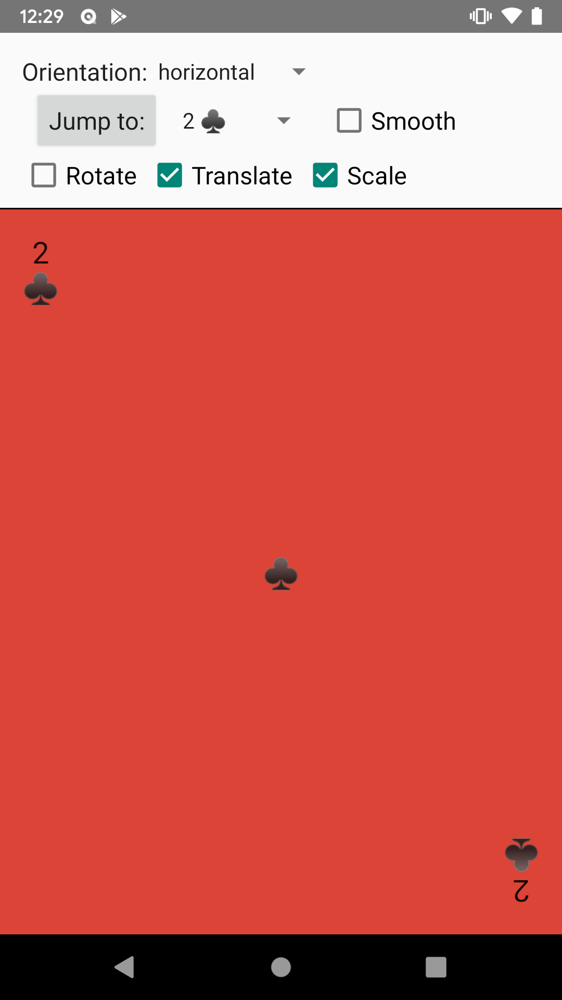
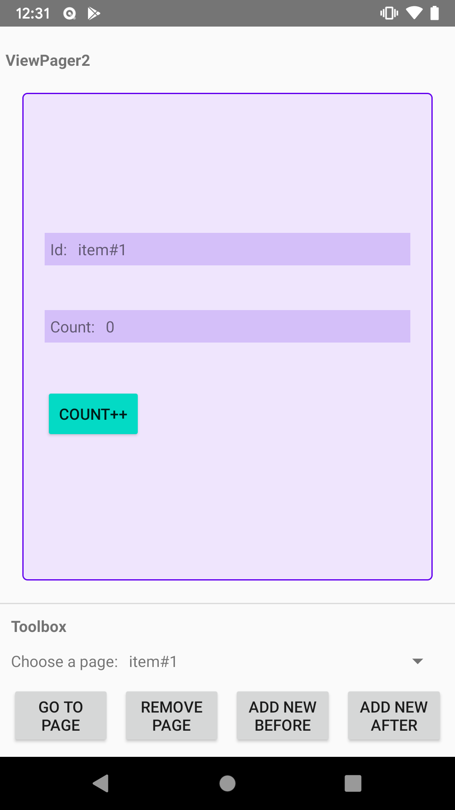
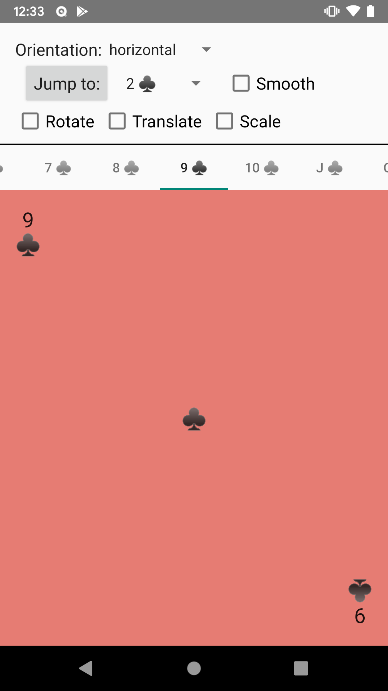

ViewPager2 samples
==================
This sample shows how to use a [ViewPager2](https://developer.android.com/reference/androidx/viewpager2/widget/ViewPager2)
with either Views or Fragments as pages, how to do page transformations, how to link it to a TabLayout and demonstrates
it with modifications in the page adapter.

ViewPager2 is the replacement of [ViewPager](https://developer.android.com/reference/androidx/viewpager/widget/ViewPager),
addressing most of its predecessor's pain-points, including right-to-left layout support, vertical orientation and
modifiable Fragment collections.

### Samples

* ViewPager2 with Views - Shows how to setup a ViewPager2 with Views as pages
* ViewPager2 with Fragments - Shows how to setup a ViewPager2 with as pages
* ViewPager2 with a Mutable Collection (Views) - Demonstrates usage of a ViewPager2 with Views as pages and mutations in the page adapter
* ViewPager2 with a Mutable Collection (Fragments) - Demonstrates usage of a ViewPager2 with Fragments as pages and mutations in the page adapter
* ViewPager2 with a TabLayout (Views) - Shows how to setup a ViewPager2 with Views as pages that is linked to a TabLayout


Getting Started
---------------

### Setting up a ViewPager2

Just like a ViewPager, a ViewPager2 needs an adapter to provide it with pages. Any
[RecyclerView.Adapter](https://developer.android.com/reference/androidx/recyclerview/widget/RecyclerView.Adapter) will
suffice for simple use cases, when your pages do not have state that needs to be restored across the Activity lifecycle.
The top level View that you will inflate for your pages must have its `layout_width` and `layout_height` set to
`match_parent`. If your pages do need to save state across lifecycles, let your adapter implement the
[StatefulAdapter](https://developer.android.com/reference/androidx/viewpager2/adapter/StatefulAdapter) interface, or
manage your own state saving (e.g., using [Lifecycle](https://developer.android.com/topic/libraries/architecture/lifecycle)).

A simple stateless example can be found in
[CardViewActivity](https://github.com/googlesamples/android-viewpager2/blob/master/app/src/main/java/com/example/androidx/viewpager2/CardViewActivity.kt).




### Using Fragments as pages

If you want to use Fragments instead of simple Views for your pages, you can let your adapter extend the
[FragmentStateAdapter](https://developer.android.com/reference/androidx/viewpager2/adapter/FragmentStateAdapter). In
it, simply return a new Fragment in its
[getItem](https://developer.android.com/reference/androidx/viewpager2/adapter/FragmentStateAdapter.html#getItem(int))
method. The FragmentStateAdapter implements StatefulAdapter, so your fragments are automatically part of the lifecycle.
Implement their
[onSaveInstanceState](https://developer.android.com/reference/androidx/fragment/app/Fragment#onSaveInstanceState(android.os.Bundle))
as you would do normally.

You can find an example of stateless Fragments in
[CardFragmentActivity](https://github.com/googlesamples/android-viewpager2/blob/master/app/src/main/java/com/example/androidx/viewpager2/CardFragmentActivity.kt),
and of stateful Fragments in
[MutableCollectionFragmentActivity](https://github.com/googlesamples/android-viewpager2/blob/master/app/src/main/java/com/example/androidx/viewpager2/MutableCollectionFragmentActivity.kt).




### Working with a TabLayout

With ViewPager, you could link it to a TabLayout by using TabLayout's
[setupWithViewPager](https://developer.android.com/reference/android/support/design/widget/TabLayout.html#setupWithViewPager(android.support.v4.view.ViewPager)).
With ViewPager2, the integration comes in the form of a mediator, the
[TabLayoutMediator](https://github.com/googlesamples/android-viewpager2/blob/master/app/src/main/java/com/example/androidx/viewpager2/TabLayoutMediator.java).
Simply create an instance of this class, pass an implementation of its `OnConfigureTabCallback` to the constructor, and
call `attach()` when you've set your ViewPager2's adapter.

You can find an example of a ViewPager2 that's linked to a TabLayout in
[CardViewTabLayoutActivity](https://github.com/googlesamples/android-viewpager2/blob/master/app/src/main/java/com/example/androidx/viewpager2/CardViewTabLayoutActivity.kt).




Support
-------
You can report issues on ViewPager2 or the samples from this repository [here](https://github.com/googlesamples/android-viewpager2/issues).


License
-------
```
Copyright 2018 The Android Open Source Project, Inc.

Licensed to the Apache Software Foundation (ASF) under one or more contributor
license agreements.  See the NOTICE file distributed with this work for
additional information regarding copyright ownership.  The ASF licenses this
file to you under the Apache License, Version 2.0 (the "License"); you may not
use this file except in compliance with the License.  You may obtain a copy of
the License at

http://www.apache.org/licenses/LICENSE-2.0

Unless required by applicable law or agreed to in writing, software
distributed under the License is distributed on an "AS IS" BASIS, WITHOUT
WARRANTIES OR CONDITIONS OF ANY KIND, either express or implied.  See the
License for the specific language governing permissions and limitations under
the License.
```